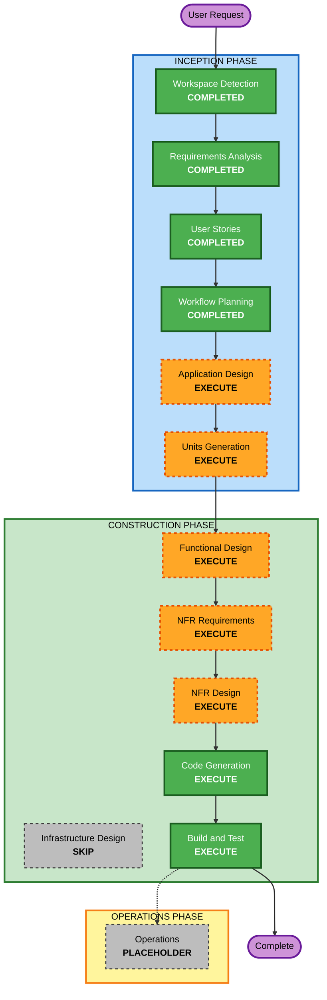

# Execution Plan

## Detailed Analysis Summary

### Change Impact Assessment
- **User-facing changes**: Yes - 개발자가 직접 사용하는 CLI 도구 신규 개발
- **Structural changes**: Yes - 전체 시스템 아키텍처 신규 설계 (오케스트레이터, 에이전트 래퍼, Git 관리, 리뷰 엔진)
- **Data model changes**: Yes - 워크플로우 상태(state.json), 설정(config.json), 리뷰 결과 구조 정의 필요
- **API changes**: Yes - CLI 인터페이스(명령어, 옵션), 에이전트 간 데이터 인터페이스 정의 필요
- **NFR impact**: Yes - 병렬 실행, 실패 복구, 로깅/대시보드, 보안 (Security Baseline, PBT 활성화)

### Risk Assessment
- **Risk Level**: Medium
- **Rollback Complexity**: Easy (Greenfield - 실패 시 재시작 가능)
- **Testing Complexity**: Moderate (CLI 프로세스 mocking, 통합 테스트 필요)

---

## Workflow Visualization

---

## Phases to Execute

### INCEPTION PHASE
- [x] Workspace Detection (COMPLETED)
- [x] Requirements Analysis (COMPLETED)
- [x] User Stories (COMPLETED)
- [x] Workflow Planning (COMPLETED)
- [ ] Application Design - **EXECUTE**
  - **Rationale**: Greenfield 프로젝트로 전체 컴포넌트 식별, 서비스 레이어 설계, 컴포넌트 간 의존성 정의가 필요. 오케스트레이터, 에이전트 래퍼, Git 관리, 리뷰 엔진 등 핵심 모듈의 책임과 인터페이스를 사전에 정의해야 함.
- [ ] Units Generation - **EXECUTE**
  - **Rationale**: 8개 에픽, 15개 유저 스토리를 구현 가능한 작업 단위(Unit of Work)로 분해 필요. 병렬 개발 가능한 단위와 의존성 순서를 결정해야 함.

### CONSTRUCTION PHASE
- [ ] Functional Design - **EXECUTE** (per-unit)
  - **Rationale**: 각 유닛별 비즈니스 로직 상세 설계 필요. 특히 리뷰 판정 엔진, 반복 사이클 관리, 상태 저장/복구 로직 등 복잡한 비즈니스 룰이 존재.
- [ ] NFR Requirements - **EXECUTE** (per-unit)
  - **Rationale**: 병렬 실행, 실패 복구, 보안(Security Baseline 활성화), PBT(활성화), 로깅/대시보드 등 다수의 NFR 요구사항 존재.
- [ ] NFR Design - **EXECUTE** (per-unit)
  - **Rationale**: NFR 요구사항이 실행으로 결정되었으므로, 각 NFR을 실제 패턴과 논리적 컴포넌트로 변환하는 설계 필요.
- [ ] Infrastructure Design - **SKIP**
  - **Rationale**: 로컬 CLI 도구로 클라우드 인프라(AWS, GCP 등) 배포 불필요. Node.js 런타임만 있으면 실행 가능.
- [ ] Code Generation - **EXECUTE** (ALWAYS, per-unit)
  - **Rationale**: 구현 필수 단계
- [ ] Build and Test - **EXECUTE** (ALWAYS)
  - **Rationale**: 빌드, 테스트, 검증 필수 단계

### OPERATIONS PHASE
- [ ] Operations - **PLACEHOLDER**
  - **Rationale**: 향후 배포/모니터링 워크플로우 확장 시 활성화

---

## Execution Summary

| Phase | Stage | Status | Rationale |
|---|---|---|---|
| INCEPTION | Workspace Detection | COMPLETED | - |
| INCEPTION | Requirements Analysis | COMPLETED | - |
| INCEPTION | User Stories | COMPLETED | - |
| INCEPTION | Workflow Planning | COMPLETED | - |
| INCEPTION | Application Design | **EXECUTE** | 전체 컴포넌트/서비스 설계 필요 |
| INCEPTION | Units Generation | **EXECUTE** | 작업 단위 분해 필요 |
| CONSTRUCTION | Functional Design | **EXECUTE** | 유닛별 상세 비즈니스 로직 설계 |
| CONSTRUCTION | NFR Requirements | **EXECUTE** | 병렬, 복구, 보안, 로깅 NFR |
| CONSTRUCTION | NFR Design | **EXECUTE** | NFR 패턴/컴포넌트 변환 |
| CONSTRUCTION | Infrastructure Design | **SKIP** | 클라우드 인프라 불필요 |
| CONSTRUCTION | Code Generation | **EXECUTE** | 필수 |
| CONSTRUCTION | Build and Test | **EXECUTE** | 필수 |
| OPERATIONS | Operations | PLACEHOLDER | 향후 확장 |

---

## Estimated Timeline
- **Total Stages to Execute**: 8 (4 completed + 8 remaining)
- **Remaining Stages**: Application Design -> Units Generation -> Functional Design -> NFR Requirements -> NFR Design -> Code Generation -> Build and Test
- **Estimated Duration**: 각 단계별 1~2 세션, 총 7~10 세션

## Success Criteria
- **Primary Goal**: Claude Code(기획) -> Codex(구현) -> Claude Code(리뷰) 자동 파이프라인이 동작하는 CLI 도구 완성
- **Key Deliverables**:
  - `dev-agent` CLI 실행 파일 (npm 패키지)
  - 기획/구현/리뷰/PR 자동화 파이프라인
  - 병렬 실행 지원
  - 실패 복구 메커니즘
  - 워크플로우 대시보드/리포트
- **Quality Gates**:
  - TypeScript 컴파일 성공
  - 단위 테스트 통과
  - Property-Based Testing 통과
  - Security Baseline 검증 통과
  - CLI 통합 테스트 (mock 기반)
